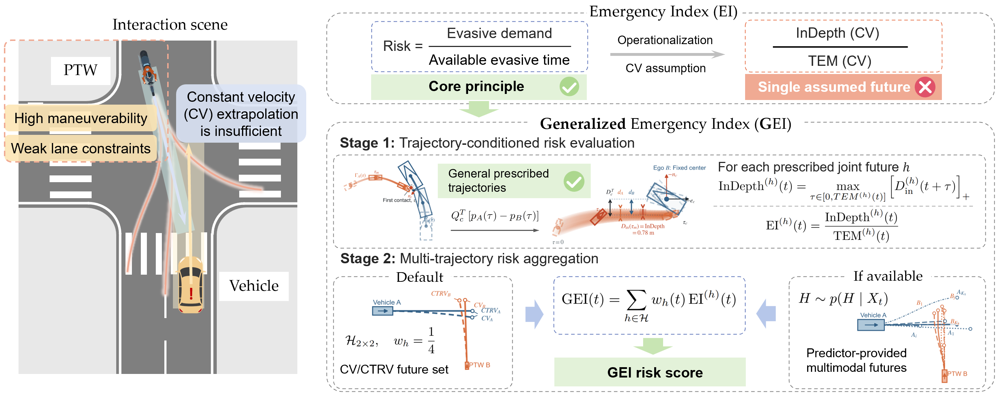
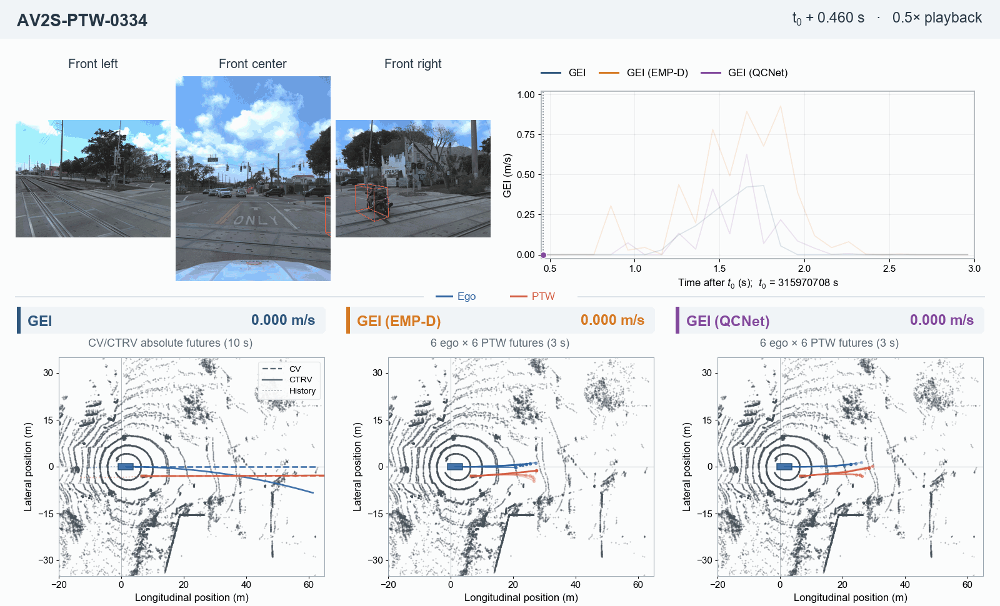
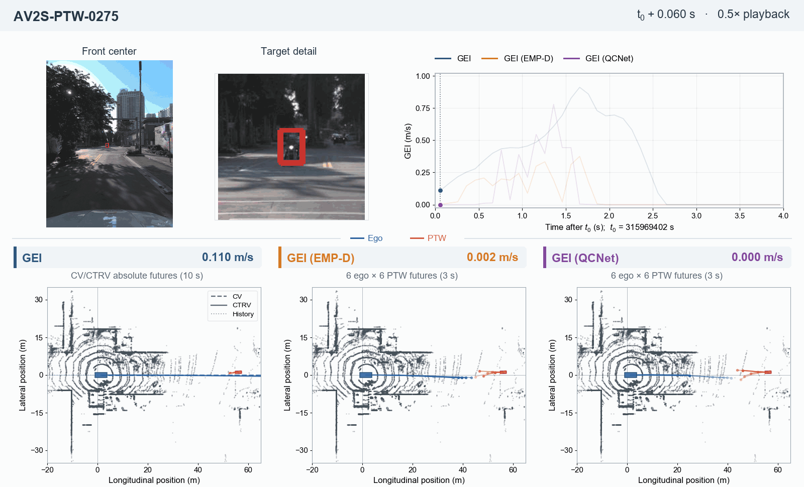
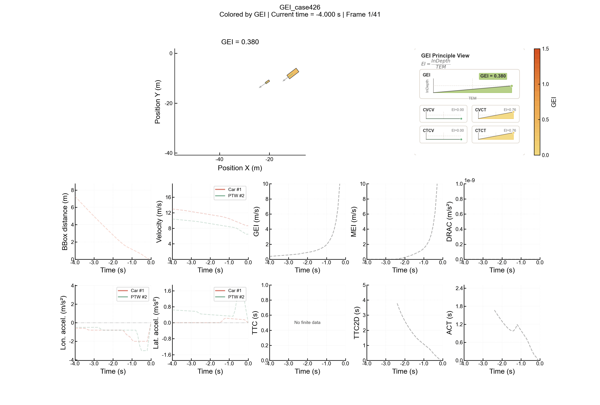

# Generalized Emergency Index (GEI)

GEI quantifies the risk of an interaction between two oriented road users over
one or more possible future trajectories. It combines **how soon their bodies
contact** with **the projected intrusion associated with that future**.

The library separates future generation from risk evaluation:

- **Current states → GEI:** use the default CV/CTRV motion hypotheses.
- **Predicted or planned trajectories → GEI:** supply your own weighted futures.
  EMP-D and QCNet output adapters are included.
- Both routes use the **same contact, InDepth and EI solver**.

[Install](#install) · [Quick example](#a-small-example-you-can-check-by-hand) ·
[Supplementary material](paper/supplementary_material.pdf) ·
[Paper-to-code guide](paper/reproducibility.md) ·
[Numerical conventions](docs/numerics.md) ·
[Same-future PC/GEI experiment](experiments/README.md)

## Framework overview

[](docs/assets/gei_framework.png)

GEI evaluates each prescribed joint future, then aggregates the resulting EI
values using their weights. The future set can come from default CV/CTRV motion
hypotheses or an external predictor or planner. Click the diagram for full size.

## Visual examples

Two AV2 Sensor cases show **GEI**, **GEI (EMP-D)** and **GEI (QCNet)** with
synchronized camera views, method-specific trajectories and a shared risk
history. Both animations play at half speed.

### AV2S-PTW-0334 — interaction across camera views

Three front-facing cameras keep the PTW visible as it moves between views.
The three risk histories highlight the same short interaction period, with
different score magnitudes and peak times.



AV2 Sensor data © 2021 Argo AI, LLC; adapted under
[CC BY-NC-SA 4.0](https://creativecommons.org/licenses/by-nc-sa/4.0/).
[Source and media notice](docs/assets/demos/MEDIA_NOTICE.md).

<details>
<summary><strong>AV2S-PTW-0275 — expand the second replay: differences in risk magnitude and timing</strong></summary>

Front-center imagery and an enlarged PTW view accompany the risk histories.
The GEI (QCNet) peak occurs approximately 0.30 s before the GEI and GEI (EMP-D)
peaks in this case.



AV2 Sensor data © 2021 Argo AI, LLC; adapted under
[CC BY-NC-SA 4.0](https://creativecommons.org/licenses/by-nc-sa/4.0/).
[Source and media notice](docs/assets/demos/MEDIA_NOTICE.md).

</details>

These are **archived paper-result replays**, not outputs recomputed with this
refactored package. Default CV/CTRV futures use a 10 s horizon; EMP-D/QCNet use
3 s with six modes per actor. The examples illustrate risk evaluation under
different future hypotheses, not a controlled predictor-accuracy comparison.
See the [replay conventions](docs/assets/demos/MEDIA_NOTICE.md#replay-conventions).

### Additional examples: naturalistic interaction and reconstructed collision

These two GIFs are preserved from the earlier public repository. They pair
scene motion with GEI and other risk-indicator curves. They are **historical
visualizations**, not results recomputed or validated against the current
refactored solver; their original in-image labels are retained.

<details>
<summary><strong>SIND Tianjin intersection — expand the naturalistic vehicle–PTW interaction</strong></summary>

A vehicle–PTW interaction at an intersection in Tianjin, China, from SIND.


[Original source and archive notice](docs/assets/legacy_demos/MEDIA_NOTICE.md).

</details>

<details>
<summary><strong>CIMSS-TA Hunan — expand the reconstructed PTW cut-in collision</strong></summary>

A reconstructed PTW cut-in collision in Hunan, China, from CIMSS-TA.



[Original source and archive notice](docs/assets/legacy_demos/MEDIA_NOTICE.md).

</details>

## Install

This is the **0.2.0 development version**.
See [migration notes](docs/migration.md) before replacing the older public code.

Python 3.10 or newer is required. From the repository root:

```bash
python -m venv .venv
# Activate: .venv\Scripts\activate on Windows, or source .venv/bin/activate on Linux/macOS
python -m pip install -e .
```

The core requires NumPy and SciPy only. A GPU, map and neural network are
**not** needed to run the examples.

## A small example you can check by hand

Consider two synthetic 2 m × 2 m bodies facing along the x-axis:

- A starts at x = 0 m and moves at 1 m/s.
- B stays at x = 5 m.
- Over a 3 s horizon, their boundaries first touch at 3 s.
- Their transverse projected intrusion is 2 m.

Therefore, the trajectory-conditioned EI is **2 / 3 ≈ 0.667 m/s**.
Because both yaw rates are zero, all four default motion combinations coincide,
and their weighted average gives the same GEI.
EI and GEI values below are displayed to three decimal places; calculations
retain full precision.

```python
from gei import ActorState, compute_gei

a = ActorState(x=0, y=0, speed=1, heading=0, yaw_rate=0, length=2, width=2)
b = ActorState(x=5, y=0, speed=0, heading=0, yaw_rate=0, length=2, width=2)

result = compute_gei(a, b, horizon=3.0)
print(f"GEI: {result.gei:.3f} m/s")
print(result.contact_probability)
# GEI: 0.667 m/s
# 1.0
```

The horizon is part of the calculation: with a 2 s horizon, these bodies have
no predicted contact, so GEI is zero. This does not mean they are safe forever.
The example explicitly uses 3 s; omitting `horizon` selects the paper's default
CV/CTRV setting of 10 s.

## Add uncertainty without changing the risk definition

Now assign A two hypothetical futures: continue moving (weight 0.25) or remain
at its current position (weight 0.75). B remains stationary in both.
These are illustrative futures, not a calibrated driving model.

```python
from gei import JointFuture, Trajectory, compute_gei_from_futures

times = [0.0, 3.0]  # seconds after the current evaluation instant
move = Trajectory(times, [[0, 0, 0], [3, 0, 0]])
stop = Trajectory(times, [[0, 0, 0], [0, 0, 0]])
other = Trajectory(times, [[5, 0, 0], [5, 0, 0]])

futures = [
    JointFuture(move, other, weight=0.25, label="continue"),
    JointFuture(stop, other, weight=0.75, label="stop"),
]
result = compute_gei_from_futures(futures, size_a=(2, 2), size_b=(2, 2))
print(f"GEI: {result.gei:.3f} m/s")  # GEI: 0.167 m/s
print(result.contact_probability)  # 0.25
print(f"{result.conditional_ei:.3f} m/s")  # 0.667 m/s
```

The computation is **GEI = 0.25 × (2 / 3) + 0.75 × 0 ≈ 0.167 m/s**.
Thus GEI is not a collision probability; it retains the EI of contacting
futures as well as their probability mass.

## Connect a trajectory predictor or planner

Supply a common coordinate frame and the current pose followed by future
`(x, y, heading)` samples. Use `JointFuture` directly when your model supplies
joint futures and their weights.

If you instead have separate mode probabilities for A and B, use
`independent_joint_futures(...)` **only under an explicit independence
assumption**. Interaction-aware marginal forecasts are not automatically joint
forecasts. The API supports arbitrary mode counts; two six-mode banks yield
36 joint futures.

The [predictor guide](docs/predictors.md) explains EMP-D/QCNet output shapes,
coordinate conversion and heading construction. Run the synthetic bridge:

```bash
python examples/predictor_bridge.py
```

This example checks the interface without a GPU; it does not run pretrained
EMP-D or QCNet. Neural inference and dataset-specific input construction remain
separate from the GEI core.

## Command line

The same examples are supplied as small JSON files:

```bash
python -m gei.cli examples/default.json
python -m gei.cli examples/weighted.json
python -m gei.cli examples/weighted.json --output result.json
```

The installed `gei` command is equivalent to `python -m gei.cli`.
Output files are not overwritten. Invalid input or failed numerical evaluation
returns a nonzero exit status, not a zero-risk result.

## Inputs and outputs

| Quantity | Convention |
|---|---|
| Position, body length/width, InDepth | metres |
| Speed, EI, GEI | metres per second |
| Time, horizon, TEM | seconds |
| Heading, yaw rate | radians, radians per second; counterclockwise positive |
| Body reference | geometric centre of an oriented rectangle |
| External poses | shape (T, 3), columns x, y, heading; include t = 0 |
| Future weights | finite, non-negative, sum to one |

External positions and unwrapped headings are interpolated between samples.
Contact is searched between samples too; sampled non-overlap is not used as a
final contact gate. The default CV/CTRV paths are evaluated analytically.

`GEIResult` contains the aggregate score, model-implied contact probability,
conditional mean EI and per-future TEM/InDepth/EI diagnostics. There is no
unique aggregate TEM or InDepth.
For default equal-weight CV/CTRV futures, `contact_probability` is the contacting
fraction of the assumed ensemble, not an empirically calibrated probability.

| Status | Meaning |
|---|---|
| `no_contact` | No contact found in the horizon; GEI = 0, conditional EI undefined |
| `finite_contact` | Positive contact time in at least one positive-weight future |
| `current_overlap` | Bodies already touch/overlap; GEI = +∞ under the boundary convention |
| Exception | Invalid input or numerical failure; never interpreted as safe |

The Python API preserves floating-point values. JSON represents infinity as
the string `"Infinity"` and undefined diagnostics as `null`.

## Interpretation and limitations

GEI evaluates **supplied future hypotheses**, not the likelihood that the
predictor is correct. A larger score is not a guarantee of a subsequent crash.
Changing the future bank, weights or horizon changes the score; no universal
warning threshold is supplied.

This is a two-dimensional rectangular-body risk model, not a vehicle controller,
an executable planner, or evidence of closed-loop safety. Body headings matter:
do not replace them blindly with noisy displacement directions.

Read [numerical conventions](docs/numerics.md) for tolerances, fallback
directions, safety-margin semantics and finite-resolution limitations.

## Reproduce and contribute

| Directory | Responsibility |
|---|---|
| `src/gei/` | Shared risk solver, default futures, and predictor-output adapters |
| `examples/` | Small runnable examples with known answers |
| `tests/` | Numerical, interface, and experiment-protocol regression tests |
| `experiments/` | Same-future PC/GEI scoring and paper-aligned AUPRC analysis |
| `docs/` | Input conventions, numerical limitations, and development instructions |
| `paper/` | Supplement and equation/experiment correspondence |
| `tools/` | Source-archive and installed-wheel release checks |

- [Paper-to-code guide](paper/reproducibility.md): equation mapping, experiment
  protocols, and the boundary between archived results and new computations.
- [Development guide](docs/development.md): tests, package checks and figure regeneration.
- [Migration notes](docs/migration.md): changes from the 0.1 API.

```bash
python -m pip install -e ".[dev]"
python -m pytest
```

Core code uses the [MIT license](LICENSE). Pretrained model weights and raw
datasets are not included. The AV2-derived demonstration GIFs are distributed
separately under [CC BY-NC-SA 4.0](docs/assets/demos/MEDIA_NOTICE.md), not MIT.
Software citation metadata is in [CITATION.cff](CITATION.cff).
